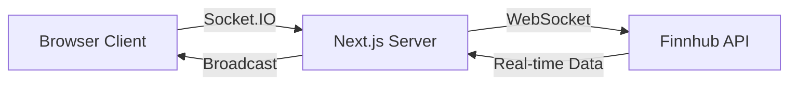

# 📊 FinBoard - Real-time Stock Market Dashboard

<div align="center">

A modern, customizable financial dashboard built with **Next.js 16** featuring real-time stock market data, interactive charts, and WebSocket-powered live updates.

[](https://nextjs.org/)
[](https://reactjs.org/)
[](https://www.typescriptlang.org/)
[](https://socket.io/)

</div>

---

## ✨ Features

### 🎯 Core Features
- **📈 Real-time Stock Updates** - WebSocket-powered live price updates with sub-second latency
- **🎨 Customizable Dashboard** - Drag-and-drop widget system with flexible layouts
- **📊 Multiple Visualizations** - Line charts, candlestick charts, data cards, and tables
- **🌓 Dark Mode** - Beautiful dark/light theme with smooth transitions
- **💾 Persistent State** - Dashboard configuration saved in local storage
- **⚡ Live Indicators** - Visual feedback with pulse animations and flash effects
- **🔄 Auto-reconnection** - Resilient WebSocket connections with automatic recovery

### 📦 Widget Types
1. **Stock Table** - Paginated table with search, filters, and sorting
2. **Finance Cards** - Watchlist, market gainers, performance metrics, financial data
3. **Line Charts** - Historical price trends with real-time updates
4. **Candlestick Charts** - OHLC data visualization for technical analysis

---

## 🛠️ Tech Stack

### Frontend
- **[Next.js 16.0.6](https://nextjs.org/)** - React framework with Turbopack
- **[React 19.2.0](https://reactjs.org/)** - UI library with React Compiler
- **[TypeScript 5.x](https://www.typescriptlang.org/)** - Type-safe development
- **[Tailwind CSS 4.1.17](https://tailwindcss.com/)** - Utility-first styling
- **[Recharts 3.5.1](https://recharts.org/)** - Chart library for data visualization
- **[React Grid Layout 1.5.2](https://github.com/react-grid-layout/react-grid-layout)** - Drag-and-drop grid system

### Backend & Real-time
- **[Socket.IO 4.8.1](https://socket.io/)** - WebSocket communication
- **[WebSocket (ws 8.18.3)](https://github.com/websockets/ws)** - Finnhub WebSocket client
- **Custom Next.js Server** - Express-like server with Socket.IO integration

### State Management & Data Fetching
- **[Zustand 5.0.9](https://github.com/pmndrs/zustand)** - Lightweight state management
- **[TanStack Query 5.90.11](https://tanstack.com/query)** - Server state management with caching
- **[date-fns 4.1.0](https://date-fns.org/)** - Date formatting utilities

### APIs
- **[Finnhub](https://finnhub.io/)** - Real-time stock WebSocket data
- **[Alpha Vantage](https://www.alphavantage.co/)** - Historical stock data (REST API)

### Development Tools
- **[tsx 4.21.0](https://github.com/privatenumber/tsx)** - TypeScript execution with hot reload
- **[dotenv 17.2.3](https://github.com/motdotla/dotenv)** - Environment variable management
- **[ESLint 9](https://eslint.org/)** - Code linting and formatting

---

## 🚀 Getting Started

### Prerequisites

Ensure you have the following installed:
- **Node.js** 18.x or higher
- **npm** or **yarn** or **pnpm**

### Installation

1. **Clone the repository**
   ```bash
   git clone https://github.com/techwizard31/Finboard.git
   cd finboard
   ```

2. **Install dependencies**
   ```bash
   npm install
   # or
   yarn install
   # or
   pnpm install
   ```

3. **Set up environment variables**
   
   Create a `.env.local` file in the root directory:
   ```bash
   # Finnhub API Key (for real-time WebSocket data)
   FINNHUB_API_KEY=your_finnhub_api_key_here

   # Alpha Vantage API Key (for historical data)
   ALPHA_VANTAGE_API_KEY=your_alpha_vantage_api_key_here

   # Application URL
   NEXT_PUBLIC_APP_URL=http://localhost:3000
   ```

   **Get your API keys:**
   - Finnhub: [https://finnhub.io/register](https://finnhub.io/register) (Free tier available)
   - Alpha Vantage: [https://www.alphavantage.co/support/#api-key](https://www.alphavantage.co/support/#api-key) (Free tier: 500 requests/day)

4. **Run the development server**
   ```bash
   npm run dev
   ```

5. **Open your browser**
   
   Navigate to [http://localhost:3000](http://localhost:3000)

---

## 📚 Usage Guide

### Creating Your First Widget

1. Click the **"+ Add Widget"** button
2. Choose widget type (Table, Card, or Chart)
3. Configure settings:
   - Enter stock symbols (e.g., `AAPL, GOOGL, MSFT`)
   - Select data interval (Daily, Weekly, Monthly)
   - Toggle real-time updates (requires Finnhub API)
4. Click **"Add to Dashboard"**

### Customizing Your Dashboard

- **Move widgets**: Drag from the header grip icon
- **Resize widgets**: Drag from bottom-right corner
- **Edit settings**: Click the ⚙️ settings icon
- **Delete widgets**: Click the 🗑️ delete icon

### Enabling Real-time Updates

1. Ensure `FINNHUB_API_KEY` is set in `.env.local`
2. Toggle **"Enable Real-time Updates"** when creating/editing a widget
3. Look for the **🔴 LIVE** indicator on active widgets
4. Prices update instantly via WebSocket connection

---

## 🌐 Real-time Updates with WebSocket

### How It Works



1. **Client Connection**: Browser connects to Socket.IO server on page load
2. **Symbol Subscription**: Widgets subscribe to specific stock symbols
3. **Finnhub Integration**: Server establishes WebSocket connection to Finnhub
4. **Live Updates**: Stock prices broadcast to all connected clients instantly
5. **Auto-reconnection**: Automatic reconnection on network interruptions

### Features

- ⚡ **Sub-second latency** for price updates
- 🎯 **Selective subscriptions** - Only fetch data for visible widgets
- 🔄 **Smart reconnection** with exponential backoff
- 📊 **Visual indicators** - Live badge, pulse animations, flash effects
- 🛡️ **Fallback support** - Graceful degradation to polling if WebSocket fails

---

## 🏗️ Project Structure

```
finboard/
├── app/                      # Next.js App Router
│   ├── api/                  # API routes
│   │   └── finance/          # Finance API endpoints
│   ├── layout.tsx            # Root layout
│   ├── page.tsx              # Home page
│   └── providers.tsx         # React Query provider
├── components/
│   ├── dashboard/            # Dashboard components
│   │   ├── AddWidgetModal.tsx
│   │   ├── DashboardGrid.tsx
│   │   └── WidgetConfigPanel.tsx
│   ├── layout/               # Layout components
│   ├── ui/                   # Reusable UI components
│   └── widgets/              # Widget implementations
│       ├── Charts/           # Chart widgets
│       ├── FinanceCard/      # Card widgets
│       └── StockTable/       # Table widget
├── hooks/                    # Custom React hooks
├── lib/                      # Utility functions
├── stores/                   # Zustand stores
├── types/                    # TypeScript type definitions
├── constants/                # App constants
├── server.ts                 # Custom Next.js server with Socket.IO
└── .env.local                # Environment variables (create this)
```

---

## 🔧 Configuration

### API Rate Limits

**Alpha Vantage (Free Tier)**
- 5 API calls per minute
- 500 API calls per day
- Supports: Daily, Weekly, Monthly data
- Premium required for intraday intervals

**Finnhub (Free Tier)**
- 60 API calls per minute
- Real-time WebSocket data for US stocks
- Upgrade for extended market coverage

### Chart Intervals

| Interval | Alpha Vantage Support | Data Type |
|----------|----------------------|-----------|
| Daily    | ✅ Free Tier         | End of day |
| Weekly   | ✅ Free Tier         | Weekly OHLC |
| Monthly  | ✅ Free Tier         | Monthly OHLC |
| Intraday | ❌ Premium Only      | 1/5/15/30/60 min |

---

## 🚢 Deployment

### Build for Production

```bash
npm run build
npm run build:server
```

### Start Production Server

```bash
npm start
```

### Deploy to Heroku

FinBoard uses a custom Next.js server with Socket.IO, which requires a platform that supports WebSocket connections.

```bash
# Install Heroku CLI
heroku login

# Create app
heroku create your-app-name

# Set environment variables
heroku config:set FINNHUB_API_KEY=your_key
heroku config:set ALPHA_VANTAGE_API_KEY=your_key

# Deploy
git push heroku main
```

**Note**: Vercel deployment not recommended due to serverless architecture limitations with Socket.IO.

---

## 🐛 Troubleshooting

### WebSocket Not Connecting

1. Verify `FINNHUB_API_KEY` is set correctly in `.env.local`
2. Restart the development server: `npm run dev`
3. Check browser console for connection errors
4. Ensure port 3000 is not blocked by firewall

### No Historical Data

1. Verify `ALPHA_VANTAGE_API_KEY` is valid
2. Check if you've exceeded rate limits (5 calls/min, 500/day)
3. Try using "Daily" interval instead of intraday
4. Check API response in server logs

### Widgets Not Saving

- Clear browser local storage and refresh
- Check browser console for errors
- Ensure local storage is enabled

---

## 🤝 Contributing

Contributions are welcome! Please feel free to submit a Pull Request.

1. Fork the repository
2. Create your feature branch (`git checkout -b feature/AmazingFeature`)
3. Commit your changes (`git commit -m 'Add some AmazingFeature'`)
4. Push to the branch (`git push origin feature/AmazingFeature`)
5. Open a Pull Request

---

## 📄 License

This project is open source and available under the [MIT License](LICENSE).

---

## 👨‍💻 Author

**techwizard31**

- GitHub: [@techwizard31](https://github.com/techwizard31)

---

## 🙏 Acknowledgments

- [Finnhub](https://finnhub.io/) for real-time market data
- [Alpha Vantage](https://www.alphavantage.co/) for historical stock data
- [Vercel](https://vercel.com/) for Next.js framework
- All open-source libraries used in this project

---

<div align="center">

### ⭐ Star this repo if you find it useful!

Made with ❤️ using Next.js and TypeScript

</div>